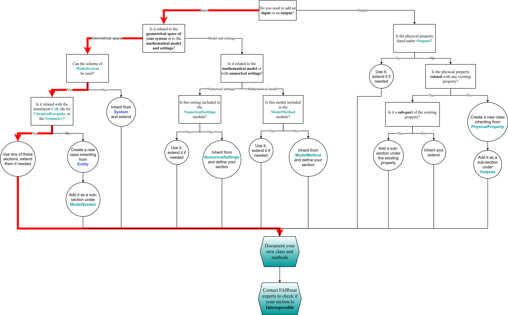

# Extending the NOMAD-Simulations schema

As you develop your parser, you may find that the `nomad-simulations` package does not include some relevant quantities for your particular use case. You can easily extend upon the schema by adding your own custom schema under the `schema_packages/` directory in your parser plugin. For this, you should utilize and build upon `nomad-simulations` for consistency and future compatibility or integration. Below is a decision tree which illustrates the schema development process:

<div class="click-zoom">
    <label>
        <input type="checkbox">
        
    </label>
</div>


From this schematic, we can identify 3 distinct uses or extensions of `nomad-simulations`:

1. Direct use of existing section definitions (without extension):
    - See how to use them in [Parser Plugins](parser_plugins.md).
2. Semantic extension of section definitions:
    - Create sections that re-define the context through inheritance from existing sections. Quantities definitions within the inherited section can be overwritten.
    - Create brand new sections.
3. Extending section definitions for normalization functionalities:
    - The section normalization functions (see [Extra: The `normalize()` class function](nomad_simulations.md#normalize-function)) can be overwritten to leverage certain tasks out of the parsers.


You can find more information about writing schemas packages in [How to write a schema package](https://nomad-lab.eu/prod/v1/docs/howto/plugins/schema_packages.html) in the NOMAD documentation.

In order to extend the `nomad-simulations` schema, [add the schema packages when generating the plugin template](parser_plugins.md/#start-plugin). This will create a sub-folder `src/<parser_name>/schema_packages` and a Python file `schema_package.py` in your parser plugin project.


In this page, we will learn about extending the current `nomad-simulations` schema, and more specifically, the [`AtomsState`](nomad_simulations.md/#atomsstate) information. We will use the same `PySCF` example, `glycine.log`, as in [Parser Plugins](parser_plugins.md). In that mainfile, we are interested on parsing the simulation cell information for each atom, i.e., we are interested on storing the geometrical state information in `AtomicCell` and in `AtomsState`. This information appears in `glycine.log` as:
```txt
...
[INPUT] Symbol           X                Y                Z      unit          X                Y                Z       unit  Magmom
[INPUT]  1 O      0.000000000000   0.000000000000   0.117790000000 AA    0.000000000000   0.000000000000   0.222590840213 Bohr   0.0
[INPUT]  2 H      0.000000000000   0.755453000000  -0.471161000000 AA    0.000000000000   1.427599269981  -0.890365250576 Bohr   0.0
[INPUT]  3 H      0.000000000000  -0.755453000000  -0.471161000000 AA    0.000000000000  -1.427599269981  -0.890365250576 Bohr   0.0
...
```

Here we have to consider that:

1. we only need to parse one of the units positions,
2. we only need to pass the symbols and the `AtomsState.normalize()` function will take care of extracting the atomic number of the chemical elements, and
3. the atomic magnetic moment (`Magmom` colum) is not defined in `AtomsState`, so **we have to extend the schema**. Note that even if they are 0.0, it is a good idea to implement the extraction now and the parsing will work for any finite atomic magnetic moment.

For capturing and returning this information, and as each element is a repeating line, we need to add a `repeats=True` condition into the `ParsedQuantity`. Our new `LogParser` will then be:
```python
class LogParser(TextParser):
    def init_quantities(self):
        self._quantities = [
            ParsedQuantity(
                'program_version', r'PySCF *version *([\d\.]+)', repeats=False
            ),
            ParsedQuantity(
                'atoms_information',
                r'\[INPUT\] *\d *([a-zA-Z])+ *([\d\.\-]+) *([\d\.\-]+) *([\d\.\-]+) *([a-zA-Z]+)[\d\.\-\s]*[a-zA-Z]* *([\d\.\-]+)',
                repeats=True
            ),
        ]
```

We have added a new `ParsedQuantity` for the atoms information: chemical element string, the three positions in cartesian coordinates, the unit of the positions, and the value of the magnetic moment. This regex returns a list of lists, in which each element of the list refers to each chemical and their position in the simulated cell. We need to manipulate the data slightly to store the information in a proper format that the schema understands. In order to do things clear, we are going to define in our `PySCFParser()` class the following variables:
```python
class PySCFParser(MatchingParser):
    def parse(
        self,
        mainfile: str,
        archive: 'EntryArchive',
        logger: 'BoundLogger',
        child_archives: dict[str, 'EntryArchive'] = None,
    ) -> None:
        
        log_parser = LogParser(mainfile=mainfile, logger=logger)
        
        simulation = Simulation()
        program = Program(
            name='PySCF', version=log_parser.get('program_version')
        )
        simulation.program = program

        # Add the `Simulation` activity to the `archive`
        archive.data = simulation

        # Match the atoms information
        atoms_information = log_parser.get('atoms_information', [])
```

Now, we want to:

1. Import `ModelSystem`, `AtomicCell`, and `AtomsState`.
2. Instantiate `ModelSystem` and append it to `simulation`.
3. Instantiate `AtomicCell` and append it to `ModelSystem`.
4. Instantiate `AtomsState` for each atom, populate these sections with the information, and append them to `AtomicCell`.

This can be done importing  the `atoms_information` matched list as:


```python
# other imports here
from nomad.units import ureg
from nomad_simulations.schema_packages.model_system import ModelSystem, AtomicCell
from nomad_simulations.schema_packages.atoms_state import AtomsState

# `configuration` and `LogParser` defined here


class PySCFParser(MatchingParser):
    def parse(
        self,
        mainfile: str,
        archive: 'EntryArchive',
        logger: 'BoundLogger',
        child_archives: dict[str, 'EntryArchive'] = None,
    ) -> None:
        
        log_parser = LogParser(mainfile=mainfile, logger=logger)
        
        simulation = Simulation()
        program = Program(
            name='PySCF', version=log_parser.get('program_version')
        )
        simulation.program = program

        # Add the `Simulation` activity to the `archive`
        archive.data = simulation

        # Match the atoms information
        atoms_information = log_parser.get('atoms_information', [])
        # Instantiate `ModelSystem` and append it to `simulation`
        model_system = ModelSystem()
        simulation.model_system.append(model_system)
        # Instantiate `AtomicCell` and append it to `ModelSystem`
        atomic_cell = AtomicCell()
        model_system.cell.append(atomic_cell)
        # Instantiate `AtomsState` for each atom, populate these sections with the information, and append them to `AtomicCell`
        positions = []
        for atom in atoms_information:
            try:
                atom_state = AtomsState(
                    chemical_symbol=atom[0],
                )
                atomic_cell.atoms_state.append(atom_state)
                position_unit = {
                    'AA': 'angstrom',
                    'Bohr': 'bohr',
                }
                positions.append(atom[1:4])
            except Exception:
                logger.warning('Matching `atoms_information` is missing some information.')
        atomic_cell.positions = positions * ureg(position_unit[atom[-2]])
```

Note that we have to map the strings in the `glycine.log` file to a format accepted by [Pint](https://pint.readthedocs.io/en/stable/). This already stores all the information of each atom, except for the magnetic moment. For the version `0.0.5` of the `nomad-simulations` package, there is no `Quantity` defined in `AtomsState` to store the magnetic moment of each atom. Thus, the solution here would be to follow the diagram above:

<div class="click-zoom">
    <label>
        <input type="checkbox">
        
    </label>
</div>

And realize that we need to extend `AtomsState` defining a new `Quantity`, `magnetic_moment`. In order to do this, we go to `src/nomad_parser_pyscf/schema_packages/schema_package.py` and change the content to:
```python
from nomad.config import config
from nomad.metainfo import Quantity, SchemaPackage

import nomad_simulations
import numpy as np


configuration = config.get_plugin_entry_point(
    'nomad_parser_pyscf.schema_packages:schema_package_entry_point'
)

m_package = SchemaPackage()


class ExtendedAtomsState(nomad_simulations.schema_packages.atoms_state.AtomsState):
    magnetic_moment = Quantity(
        type=np.float64,
        default=0.0,
        unit='bohr_magneton',
        description="""
        Magnetic moment of the atom in Bohr magneton units. This quantity is relevant only for spin-polarized calculations.
        """
    )


m_package.__init_metainfo__()
```

Note that we defined a new class, so in the parser we need to import this instead of the `AtomsState` defined in `nomad-simulations`, as well as adding the parsing of the magnetic moment:
```python
# other imports here
from nomad.units import ureg
from nomad_simulations.schema_packages.model_system import ModelSystem, AtomicCell

from nomad_parser_pyscf.schema_packages.schema_package import ExtendedAtomsState

# `configuration` and `LogParser` defined here


class PySCFParser(MatchingParser):
    def parse(
        self,
        mainfile: str,
        archive: 'EntryArchive',
        logger: 'BoundLogger',
        child_archives: dict[str, 'EntryArchive'] = None,
    ) -> None:
        
        log_parser = LogParser(mainfile=mainfile, logger=logger)
        
        simulation = Simulation()
        program = Program(
            name='PySCF', version=log_parser.get('program_version')
        )
        simulation.program = program

        # Add the `Simulation` activity to the `archive`
        archive.data = simulation

        # Match the atoms information
        atoms_information = log_parser.get('atoms_information', [])
        # Instantiate `ModelSystem` and append it to `simulation`
        model_system = ModelSystem()
        simulation.model_system.append(model_system)
        # Instantiate `AtomicCell` and append it to `ModelSystem`
        atomic_cell = AtomicCell()
        model_system.cell.append(atomic_cell)
        # Instantiate `AtomsState` for each atom, populate these sections with the information, and append them to `AtomicCell`
        positions = []
        for atom in atoms_information:
            try:
                atom_state = ExtendedAtomsState(
                    chemical_symbol=atom[0],
                    magnetic_moment=atom[-1] * ureg('bohr_magneton')
                )
                atomic_cell.atoms_state.append(atom_state)
                position_unit = {
                    'AA': 'angstrom',
                    'Bohr': 'bohr',
                }
                positions.append(atom[1:4])
            except Exception:
                logger.warning('Matching `atoms_information` is missing some information.')
        atomic_cell.positions = positions * ureg(position_unit[atom[-2]])
```

You can print out the `archive` and its sub-sections to check that the information is properly stored.
